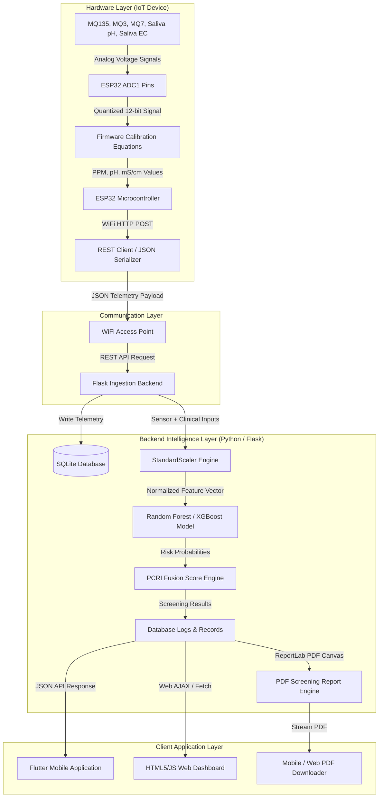

# NeoPanc-Ai 🩺 Volatile Organic Compound (VOC) & Salivary Biomarker Risk Screening System

[](LICENSE)
[](backend/)
[](flutter_app/)
[](firmware/)
[](backend/models/)
[](docs/final_report.md)

**NeoPanc-Ai** (also known as *NeoPanc*) is an end-to-end, non-invasive, AI-driven IoT risk screening platform for early pancreatic cancer indicators. By fusing exhaled breath volatile organic compounds (VOCs) and salivary biomarkers (pH and electrical conductivity) with clinical survey parameters, the system computes a continuous **Pancreatic Cancer Risk Index (PCRI)** score (0–100) and provides actionable risk-stratified clinical recommendations.

---

## 📌 Executive Summary & Clinical Context

Pancreatic ductal adenocarcinoma (PDAC) has one of the lowest 5-year survival rates (~11%) among all cancers, largely due to late-stage diagnosis. Early symptoms are non-specific, and initial diagnostics currently rely on costly imaging (CT, MRI, EUS) or invasive biopsies. 

**NeoPanc-Ai** addresses this challenge by providing a **low-cost, portable, non-invasive primary risk screening tool** suitable for point-of-care environments and preliminary clinical evaluations.

### Key Biomarker Channels
1. **Breath Volatile Organic Compounds (VOCs):** Exhaled breath metabolic markers including acetone, ethanol, acetaldehyde, and amine derivatives measured via gas sensors (`MQ135`, `MQ3`, `MQ7`).
2. **Salivary Acidity (pH):** Physiological shifts induced by pancreatic insufficiency or localized inflammation.
3. **Salivary Electrical Conductivity (EC):** Concentration of salivary inorganic ions and altered metabolic waste products measured in mS/cm.
4. **Clinical Risk Parameters:** Patient age, BMI, smoking/alcohol habits, diabetes status, family history, weight loss, abdominal discomfort, appetite changes, and jaundice.

---

## 🏗️ System Architecture

The project integrates IoT hardware telemetry, cloud REST API services, machine learning classifiers, and a mobile/web user interface.



---

## 🔬 AI Machine Learning Engine & Performance

The backend classifier was trained and evaluated on a **1,200-sample screening cohort dataset**. 

### Classification Performance Metrics
- **Overall Model Accuracy:** `84.17%`
- **Low Risk Group:** Precision `86%`, Recall `99%`
- **Moderate Risk Group:** Precision `50%`, Recall `16%`
- **High Risk Group:** Precision `90%`, Recall `60%`

### Biomarker Feature Weight Ranking
| Rank | Feature Parameter | Category | Split Importance Weight |
| :---: | :--- | :--- | :---: |
| 1 | **MQ3 PPM** | Breath VOC (Ethanol / Alcohols) | **17.09%** |
| 2 | **MQ135 PPM** | Breath VOC (Air Quality / Amine) | **15.47%** |
| 3 | **MQ7 PPM** | Breath VOC (Carbon Monoxide) | **14.94%** |
| 4 | **Saliva Electrical Conductivity (EC)** | Salivary Biomarker (mS/cm) | **12.72%** |
| 5 | **Age** | Clinical Demographics | **11.44%** |
| 6 | **Saliva pH** | Salivary Biomarker | **8.58%** |

### PCRI Score Calculation Formula
The Pancreatic Cancer Risk Index (PCRI) maps multi-sensor anomaly metrics and clinical probability vectors onto a continuous 0–100 scale:

$$\text{PCRI} = w_{\text{sensor}} \cdot S_{\text{norm}} + w_{\text{model}} \cdot P(\text{High Risk}) \times 100$$

- **Low Risk (0 - 35):** Regular monitoring recommended.
- **Moderate Risk (36 - 65):** Secondary screening & follow-up evaluation suggested.
- **High Risk (66 - 100):** Immediate clinical consultation and oncology diagnostic workup advised.

---

## 🔌 Hardware Schematics & Pin Mapping

The hardware prototype utilizes an **ESP32 microcontroller** operating strictly on **ADC1** pins (since WiFi usage disables ADC2 channels on ESP32).

### ESP32 Pin Connection Table
| Component | Function / Channel | ESP32 Pin | Voltage Level | Notes |
| :--- | :--- | :--- | :--- | :--- |
| **MQ135** | VOC / Air Quality Sensor | **GPIO 34 (ADC1)** | 5V VCC / 3.3V Signal | Requires resistor voltage divider |
| **MQ3** | Breath Alcohol Sensor | **GPIO 35 (ADC1)** | 5V VCC / 3.3V Signal | External 5V rail required (~150mA) |
| **MQ7** | Carbon Monoxide Sensor | **GPIO 32 (ADC1)** | 5V VCC / 3.3V Signal | External 5V rail required (~150mA) |
| **Saliva pH** | Acidity Driver Board | **GPIO 33 (ADC1)** | 5V VCC / 3.0V Signal | Calibrated via 4.01 and 7.00 buffers |
| **Saliva EC** | Conductivity Module | **GPIO 39 (ADC1)** | 3.3V VCC / Signal | Measured in mS/cm |

> [!WARNING]
> **Power Supply Requirement:** Gas sensor heaters collectively consume ~450mA. Use an external 5V 2A power rail with common GND connected to the ESP32.

---

## 📁 Repository Directory Structure

```text
HealthCare-Ai/
├── backend/                        # Python Flask REST API & ML Server
│   ├── app.py                      # Flask Application Entry Point & API Routes
│   ├── database.py                 # SQLite ORM Database Schemas
│   ├── generate_dataset.py         # Synthetic Medical Screening Data Generator
│   ├── train_model.py              # ML Model Training & Serialization Script
│   ├── requirements.txt            # Python Dependencies List
│   ├── render.yaml                 # Deployment configuration for Render
│   ├── models/                     # Saved ML Models (`model.pkl`, `scaler.pkl`)
│   ├── templates/                  # Web Dashboard HTML Templates (`index.html`)
│   └── static/                     # Web Dashboard CSS & JavaScript Assets
├── flutter_app/                    # Mobile Application (Flutter/Dart)
│   ├── lib/                        # Flutter Application Source Code
│   │   ├── main.dart               # App Entry Point
│   │   ├── screens/                # UI Screens (Dashboard, Questionnaire, Results)
│   │   └── services/               # API & Battery Service Connectors
│   ├── android/                    # Native Android Platform Files
│   ├── web/                        # Web Build Platform Configuration
│   └── pubspec.yaml                # Flutter Dependencies File
├── firmware/                       # IoT Device Firmware
│   └── esp32_firmware.ino          # ESP32 C++ Arduino Code (Multi-sensor Telemetry)
├── docs/                           # Project Research & Technical Documentation
│   ├── ieee_paper.md               # Draft IEEE Research Paper Manuscript
│   ├── patent_draft.md             # Invention Patent Application Specification
│   ├── final_report.md             # Complete Project & Thesis Report
│   ├── block_diagram.md            # System Architecture & Sequence Diagrams
│   ├── circuit_diagram.md          # Hardware Schematic & Electrical Connections
│   └── user_manual.md              # User & Clinical System Operational Guide
└── README.md                       # Project Overview & Setup Documentation
```

---

## ⚡ Quick Start & Installation Guide

### 1. Flask Backend Setup

```bash
# Clone the repository
git clone https://github.com/Monishwarann/Neopanc.git
cd Neopanc/backend

# Create a virtual environment
python -m venv venv
source venv/bin/activate  # On Windows: venv\Scripts\activate

# Install dependencies
pip install -r requirements.txt

# (Optional) Generate training dataset and train model
python generate_dataset.py
python train_model.py

# Run the Flask development server
python app.py
```
The server will start at `http://localhost:5000`.

---

### 2. Flutter Mobile Application Setup

```bash
cd Neopanc/flutter_app

# Get dependencies
flutter pub get

# Run on connected device or emulator
flutter run
```

---

### 3. ESP32 Firmware Setup

1. Open `firmware/esp32_firmware.ino` in **Arduino IDE**.
2. Install `WiFi.h` and `HTTPClient.h` libraries (built-in for ESP32 core).
3. Update WiFi credentials and backend API endpoint URL:
   ```cpp
   const char* ssid = "YOUR_WIFI_SSID";
   const char* password = "YOUR_WIFI_PASSWORD";
   const char* serverEndpoint = "http://YOUR_SERVER_IP:5000/api/telemetry";
   ```
4. Select board **ESP32 Dev Module** and upload the firmware.

---

## 🌐 API Endpoint Reference

| Method | Endpoint | Description | Request Payload Sample |
| :---: | :--- | :--- | :--- |
| `POST` | `/api/telemetry` | Submit raw sensor telemetry from ESP32 | `{"user_id": 1, "mq135": 14.2, "mq3": 8.5, "mq7": 5.1, "saliva_ph": 6.8, "saliva_ec": 1.4}` |
| `POST` | `/api/predict` | Run AI Risk Screening calculation | `{"age": 55, "bmi": 26.5, "smoking": 1, "diabetes": 0, "mq135": 14.2, ...}` |
| `GET` | `/api/generate-pdf/<id>` | Download compiled PDF clinical report | *URL Parameter: `log_id`* |
| `GET` | `/health` | Server health check endpoint | Returns `{"status": "healthy"}` |

---

## 📄 License & Academic Reference

This repository is licensed under the [MIT License](LICENSE).

If you use this work, firmware code, or biomarker dataset in your research or project, please cite:

```bibtex
@article{neopanc_ai_2026,
  title={AI-Driven Non-Invasive Multi-Sensor IoT-Based Early Pancreatic Cancer Risk Screening System Using Breath and Saliva Biomarkers},
  author={Monishwaran K. et al.},
  journal={IEEE Research Documentation / NeoPanc-Ai Technical Specifications},
  year={2026}
}
```
