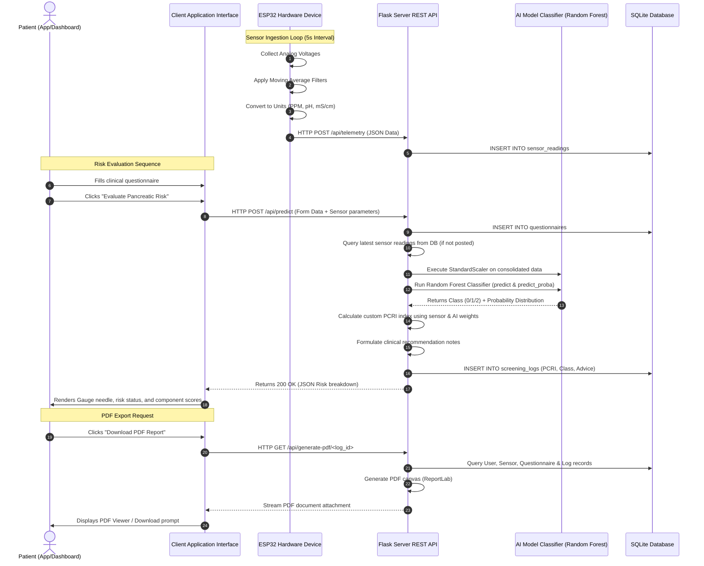

# System Architecture and Data Flows

This document visualizes the software subsystems, execution sequences, and data flows of the NeoPanc system.

## Subsystem Architecture Block Diagram

```mermaid
graph TB
    subgraph Hardware Layer (IoT Device)
        Sensors[MQ135, MQ3, MQ7, pH, EC] -->|Analog Voltage| ADC[ESP32 ADC1 Multiplexer]
        ADC -->|12-bit Quantized Value| Calibration[Firmware Calibration Equations]
        Calibration -->|PPM, pH, mS/cm Values| ESP32Core[ESP32 Core Microcontroller]
        ESP32Core -->|WiFi client| HTTPClient[HTTP client / JSON Serializer]
    end

    subgraph Communication Channel
        HTTPClient -->|HTTP POST Request| WiFi[WiFi / Local Access Point]
        WiFi -->|JSON Payload over REST API| FlaskREST[Flask REST Ingestion Endpoint]
    end

    subgraph Backend Intelligence Layer (Flask App)
        FlaskREST -->|Write Raw Telemetry| DB[(SQLite Database)]
        DB -->|Query Historical Context| HistoryQuery[History Logger]
        
        FlaskREST -->|Forward Telemetry Data| PredictionEngine[Risk Ingestion Engine]
        Questionnaire[Digital Questionnaire Input] -->|POST Form Data| PredictionEngine
        
        PredictionEngine -->|Scaled Clinical + Sensor Arrays| Scaler[StandardScaler pkl]
        Scaler -->|Normalized Vectors| RFClassifier[Random Forest Classifier pkl]
        
        RFClassifier -->|Risk Levels & Confidence Scores| PCRIEngine[PCRI Fusion Score Engine]
        PCRIEngine -->|Combined Index Calculation| LogReport[Database Screening Logs]
        
        LogReport -->|HTML REST Serializer| ResponseJSON[Response JSON Object]
        LogReport -->|ReportLab Document Generator| PDFGenerator[PDF Report Compiler]
    end

    subgraph Client Application Layer
        ResponseJSON -->|API Ingestion| FlutterApp[Flutter Mobile Application]
        ResponseJSON -->|Fetch / AJAX | WebDashboard[Web Screening Dashboard]
        PDFGenerator -->|PDF Attachment download| ClientBrowser[Web / App PDF Download]
    end
```

---

## Detailed Evaluation Processing Sequence


