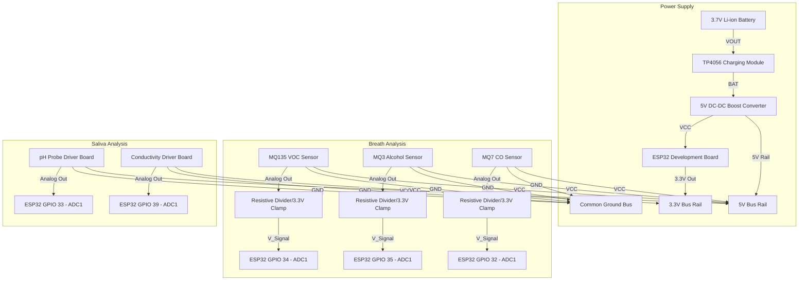

# Circuit Diagram and Electrical Connections

This document details the hardware schematics and wiring connections for the **Neo-Panc IoT Device**.

## System Block Diagram (Electrical Layout)

---

## Pin Connection Mapping

| Component | Component Pin | ESP32 Pin | Logic Level | Connection Purpose |
| :--- | :--- | :--- | :--- | :--- |
| **MQ135 Sensor** | VCC | External 5V | 5.0V | Internal heater core & comparator |
| | GND | Common GND | 0.0V | Ground path |
| | AO (Analog Out) | **GPIO 34** | 3.3V Max (via divider) | Volatile organic compound analog signal |
| **MQ3 Sensor** | VCC | External 5V | 5.0V | Internal heater core & comparator |
| | GND | Common GND | 0.0V | Ground path |
| | AO (Analog Out) | **GPIO 35** | 3.3V Max (via divider) | Breath ethanol and metabolites |
| **MQ7 Sensor** | VCC | External 5V | 5.0V | Internal heater core & comparator |
| | GND | Common GND | 0.0V | Ground path |
| | AO (Analog Out) | **GPIO 32** | 3.3V Max (via divider) | Breath carbon monoxide |
| **Saliva pH Driver**| VCC | ESP32 5V (USB/VIN)| 5.0V | Operational Amplifier supply |
| | GND | Common GND | 0.0V | Ground path |
| | AO (Analog Out) | **GPIO 33** | 0 - 3.0V | Salivary acidity level indicator |
| **Saliva EC Driver**| VCC | ESP32 3.3V | 3.3V | Conductivity probe excitation voltage |
| | GND | Common GND | 0.0V | Ground path |
| | AO (Analog Out) | **GPIO 39** | 0 - 3.3V | Ionic waste/salivary conductivity |

---

## Critical Assembly Guidelines

> [!WARNING]
> **1. Shared Common Ground:** Always bridge the GND terminal of the external 5V boost converter directly to the GND pin of the ESP32. Unconnected grounds create floating voltages and induce significant measurement noise in the ADC readings.
> 
> **2. Resistive Dividers for MQ Sensors:** MQ-series gas sensors typically output analog signals scaling up to 5.0V. The ESP32 GPIO pins are not 5V tolerant and will burn out if exposed directly. You **must** solder a simple voltage divider (e.g., $10\text{ k}\Omega$ and $20\text{ k}\Omega$ resistors) to step down the 0–5V signal to a safe 0–3.3V level.
> 
> **3. External 5V Power Source:** The heating elements inside the MQ135, MQ3, and MQ7 sensors collectively draw up to $450\text{ mA}$ during operation. The ESP32's onboard regulator cannot supply this level of current. Use an external $2\text{ A}$ battery charging pack with a boost circuit to supply the 5V power bus.
